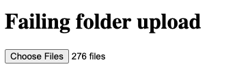
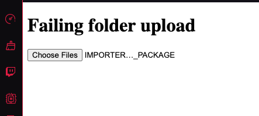

# Folder Upload Failing in Opera GX

When selecting a folder to be uploaded, only the folder name is read not the contents of the folder.

### Chrome

Files in the folder can be accessed using `input.files` which shows an array of files.
Shows the number of files in the uploaded folder. 

### Opera

Shows the name of the folder.
`input.files` only shows 1 file instead of the folder.

